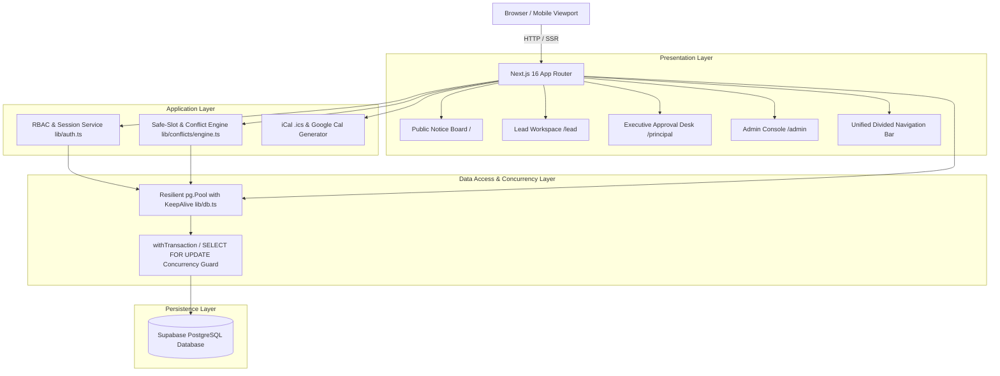
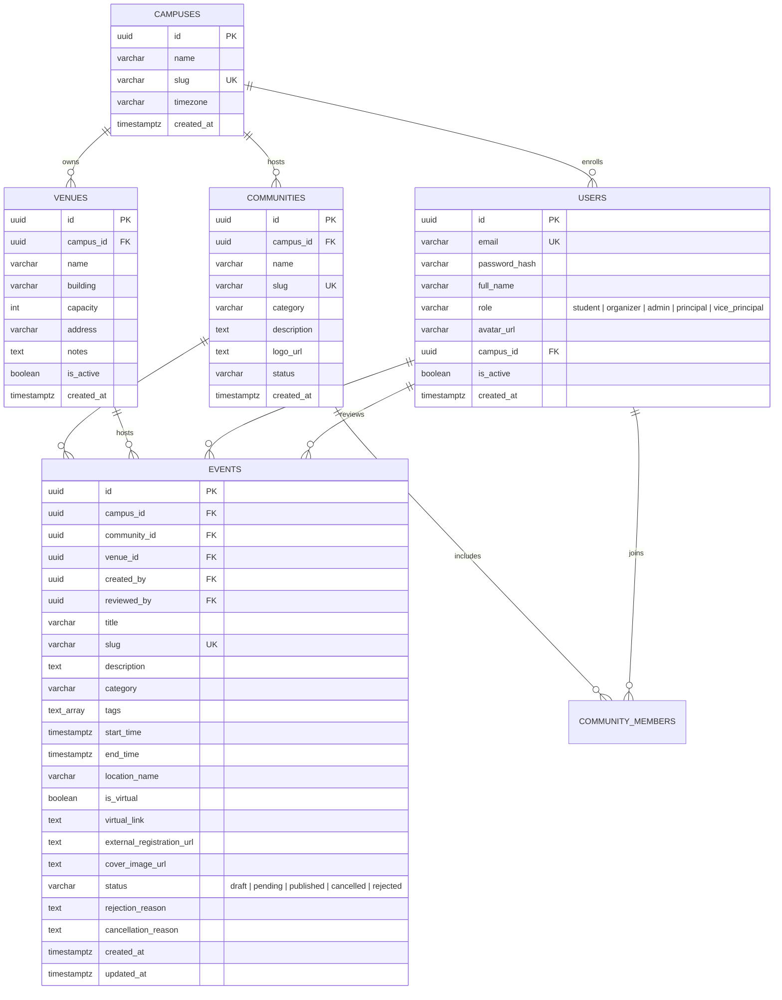

# SaveSlot System Design Document

**Product**: SaveSlot — Campus Events & Scheduling Platform  
**Target Institution**: Albertian Institute of Science & Technology (AISAT)  
**Version**: 1.2.0 (Current Production Build)  
**Status**: Implemented & Verified  

---

## 1. Executive Summary & Vision

**SaveSlot** is a high-craft campus event scheduling, conflict-prevention, and public notice board platform. It resolves institutional scheduling friction across college communities, students, and executive administration by replacing scattered chat announcements and paper approval forms with:

1. **A Unified Public Notice Board**: Interactive monthly, weekly, and kanban-style board views with real-time filtering by category, search queries, and time horizons.
2. **Automated Conflict Prevention & Safe-Slot Engine**: Algorithmic detection of venue double-bookings and lead-time violations, coupled with deterministic 3-way alternative slot suggestions.
3. **Multi-Tier Institutional Governance (RBAC)**: Role-tailored workspaces for Community Leads, Campus Administrators, College Principals, and Vice Principals with concurrency-safe event triage.
4. **Unified Divided Navigation Architecture**: An intentional, distraction-free Linear/Apple-inspired UI that consolidates calendar view modes and executive desk shortcuts into a single segmented pill container.

---

## 2. High-Level System Architecture

The platform is built on Next.js 16 (App Router with Turbopack), React 19, and Tailwind CSS v4, connecting to a PostgreSQL database hosted on Supabase via connection pooling.



---

## 3. Technology Stack & Key Dependencies

| Layer | Technology | Version | Purpose / Rationale |
| :--- | :--- | :--- | :--- |
| **Framework** | Next.js | `16.3.5` | App Router, Server Components (SSR), Turbopack bundler, API routes |
| **UI Runtime** | React | `19.2.8` | Server & Client Components (`"use client"`), hooks, concurrent rendering |
| **Styling** | Tailwind CSS | `v4.0` | Modern `@tailwindcss/postcss`, zero-runtime CSS variables, utility tokens |
| **Database** | PostgreSQL / Supabase | `15+` | Relational integrity, foreign keys, JSON aggregation, transactional locks |
| **DB Client** | `pg` (node-postgres) | `8.13.1` | Low-level connection pool with TCP keepAlive and resilient query retry |
| **Date & Time** | `date-fns` | `4.1.0` | Immutable, localized date manipulation and interval intersection |
| **Icons** | `lucide-react` | `0.475.0` | Minimalist line icons |
| **Validation** | `zod` | `3.24.2` | Runtime schema validation for API request bodies and route parameters |

---

## 4. Database Schema & Data Models

The relational database enforces data integrity through foreign keys, check constraints, and performance indexes.



### 4.1 Schema Enforcements & Indexes

1. **User Role Constraint**:

   ```sql
   ALTER TABLE public.users 
   ADD CONSTRAINT users_role_check 
   CHECK (role IN ('student', 'organizer', 'admin', 'principal', 'vice_principal'));
   ```

2. **Reviewer Attribution (`reviewed_by`)**:
   Tracks the exact user UUID of the principal, vice principal, or administrator who approved or rejected the event.
3. **Critical Performance Indexes**:

   ```sql
   CREATE INDEX idx_events_timeline ON public.events (start_time, end_time, status);
   CREATE INDEX idx_events_venue_window ON public.events (venue_id, start_time, end_time) WHERE status != 'rejected';
   CREATE INDEX idx_events_community ON public.events (community_id);
   ```

---

## 5. Safe-Slot Conflict Detection & Recommendation Engine

The conflict engine (`src/lib/conflicts/engine.ts`) prevents venue double-booking and enforces institutional policy before event proposal submission.

### 5.1 Temporal Clash Formula

An overlap between a candidate event `[Ts, Te]` and an existing event `[Es, Ee]` in the same venue `V` is defined as:

$$\text{Overlap} \iff (T_s < E_e) \land (T_e > E_s) \land (\text{status} \neq \text{'rejected'}) \land (\text{status} \neq \text{'cancelled'})$$

### 5.2 Policy Violations

- **Lead Time Rule**: Submissions must occur at least 7 days ahead of `start_time` (`start_time < now() + 7 days`). The UI warns leads if lead time is violated while permitting submission with caution.
- **Venue Inactivity**: Events cannot be proposed in deactivated venues (`is_active = false`).

### 5.3 Deterministic Safe-Slot Discovery Algorithm

When a clash is detected, the engine executes three heuristic search strategies to suggest alternative safe slots:

```
[Target Venue Clash Detected]
         │
         ├─► Option A: Same Venue, Later Today
         │   (Earliest 30-minute buffer after conflicting event: Ee + 30m)
         │
         ├─► Option B: Alternative Active Venue at Same Time
         │   (Queries all active venues with matching capacity free during [Ts, Te])
         │
         └─► Option C: Next Available Day, Same Time Window
             (Advances candidate window by +24 hours until target venue is clear)
```

Each suggestion is serialized as a `SafeSlotSuggestion` with a 1-click **"Apply Slot"** action in the proposal modal.

---

## 6. UI/UX Design System & Navigation Architecture

SaveSlot adheres to a quiet, high-craft Linear / Apple design aesthetic. It eliminates SaaS clichés (rainbow gradients, neon badges, fake metric tickers) in favor of typography, subtle hairline borders, and tactile touch states.

### 6.1 Unified Divided Navigation Bar

On the public calendar home (`/`), the navbar centers a unified segmented pill container:

```
┌────────────────────────────────────────────────────────────────────────┐
│  SaveSlot AISAT   October 2026 < > Today                                │
│                                                                        │
│          ┌──────────────────────────────────────────────────┐          │
│          │ [📅 Month]  [📅 Week]  [⊞ Board]  │  [🎓 VP Desk] │          │
│          └──────────────────────────────────────────────────┘          │
│                                                                        │
│                                    Mr Paul Ansel V / VP  [M]  [Logout] │
└────────────────────────────────────────────────────────────────────────┘
```

- **Single Container Architecture**: Both the calendar view switcher (`Month`, `Week`, `Board`) and the role workspace shortcut (`Vice Principal Desk`, `Lead Workspace`, or `Admin Console`) live inside one container (`bg-slate-100/90 border-slate-200/80 rounded-xl`).
- **Hairline Divider**: A `w-px h-4 bg-slate-300/80` element cleanly separates the calendar view modes from the executive workspace shortcut.
- **No Redundant Tabs**: Eliminates duplicate "Calendar" buttons while on `/`. When navigating to `/principal`, the navbar seamlessly switches to a clean two-tab segmented nav (`[📅 Calendar] [🎓 Vice Principal Desk]`).

### 6.2 View Modes on Notice Board (`/`)

1. **Month View**: Traditional 7-column calendar grid with date badges, event pills colored by category, and overflow counters.
2. **Week View**: Time-blocked weekly layout emphasizing start times and daily venue distribution.
3. **Board View**: Category-grouped kanban swimlanes ideal for scanning campus activities by discipline (Tech, Cultural, Sports, Career, Academic, Workshop).

### 6.3 Executive Approval Desk (`/principal`)

- **Dual Tab Interface**:
  - **Pending Triage Queue**: Cards displaying proposed events, organizer details, proposed venue, capacity utilization, lead time badge, and conflict status.
  - **Review History**: Filterable chronological audit log displaying past approvals, rejections with written rationales, and the reviewer's identity.
- **Action Modal**: Explicit approval or rejection with mandatory written feedback returned to the Community Lead.

---

## 7. Security, Concurrency & RBAC

### 7.1 Role-Based Access Control (RBAC) Matrix

| Persona | Role Key | Notice Board (`/`) | Lead Workspace (`/lead`) | Principal Desk (`/principal`) | Admin Console (`/admin`) |
| :--- | :--- | :---: | :---: | :---: | :---: |
| **Student / Public** | `student` / guest | View & Export | ❌ | ❌ | ❌ |
| **Community Lead** | `organizer` | View & Export | Propose & Manage | ❌ | ❌ |
| **Vice Principal** | `vice_principal` | View & Export | ❌ | Review & Approve | ❌ |
| **College Principal** | `principal` | View & Export | ❌ | Review & Approve | ❌ |
| **Campus Admin** | `admin` | View & Export | Superuser | View / Override | Full CRUD (Venues/Users) |

### 7.2 Session Authentication

- **HTTP-Only Cookie**: Sessions are serialized into secure, HTTP-only JWT cookies (`saveslot_session`).
- **Server Guard**: Layouts at `src/app/lead/layout.tsx`, `src/app/principal/layout.tsx`, and `src/app/admin/layout.tsx` enforce server-side authentication and role verification before rendering downstream components.

### 7.3 Concurrency Control & Double-Booking Guard

To prevent Time-of-Check to Time-of-Use (TOCTOU) race conditions during concurrent triage:

```typescript
await withTransaction(async (client) => {
  // 1. Lock the candidate event row
  const event = await client.query(
    "SELECT * FROM public.events WHERE id = $1 FOR UPDATE;",
    [eventId]
  );
  
  // 2. Lock and check for colliding published events
  const clash = await client.query(
    `SELECT id FROM public.events 
     WHERE venue_id = $1 
       AND status = 'published'
       AND (start_time < $3 AND end_time > $2)
     FOR UPDATE;`,
    [event.venue_id, event.start_time, event.end_time]
  );

  if (clash.rows.length > 0) {
    throw new Error("Conflict detected: Venue was booked concurrently.");
  }

  // 3. Commit publication
  await client.query(
    "UPDATE public.events SET status = 'published', reviewed_by = $2 WHERE id = $1;",
    [eventId, reviewerId]
  );
});
```

---

## 8. Database Reliability & Connection Management

Connecting to Supabase's transaction pooler (PgBouncer on port `6543`) over remote cloud networks requires resilient connection pool configuration (`src/lib/db.ts`):

1. **Extended Connection Timeout**: Configured `connectionTimeoutMillis: 15000` (15s) with environment override (`DB_CONNECTION_TIMEOUT_MS`) to prevent connection drop during cold-start TLS handshakes.
2. **TCP Keep-Alive**: Configured `keepAlive: true` and `keepAliveInitialDelayMillis: 10000` to prevent intermediate NAT firewalls from silently terminating idle sockets.
3. **Idle Client Listener**: Registered `pool.on("error", ...)` to catch and discard stale sockets dropped by remote PgBouncer without crashing the Node.js process.
4. **Transient Query Retry**: Implemented automatic single-retry in `query(...)` for dropped socket errors (`Connection terminated`, `ECONNRESET`, or `57P01`).
5. **Allowed Dev Origins**: Whitelisted LAN IPs in `next.config.ts` (`allowedDevOrigins`) for smooth hot-module reloading during local and mobile testing.

---

## 9. Calendar Export Integrations

1. **Google Calendar URL Generator**: Direct deep links encoding event title, start/end timestamps in UTC format (`YYYYMMDDTHHmmssZ`), venue name, and description.
2. **RFC 5545 `.ics` File Builder**: Generates standardized iCalendar files with `UID`, `SUMMARY`, `DESCRIPTION`, `LOCATION`, and `DTSTART`/`DTEND` properties compatible with Apple Calendar, Microsoft Outlook, and mobile calendar clients.

---

## 10. Verification & Build Standards

- **Build Verification**: Verified production builds with `pnpm build` via Next.js 16 Turbopack compiler.
- **Responsive Testing**: Form-factored for viewports from 360px mobile screens (Galaxy A55 / iPhone SE) to 1920px desktop displays.
- **Git Protocol**: Atomic commits separating backend configuration from frontend UI changes, submitted via pull requests per GitHub branch protection rules.
